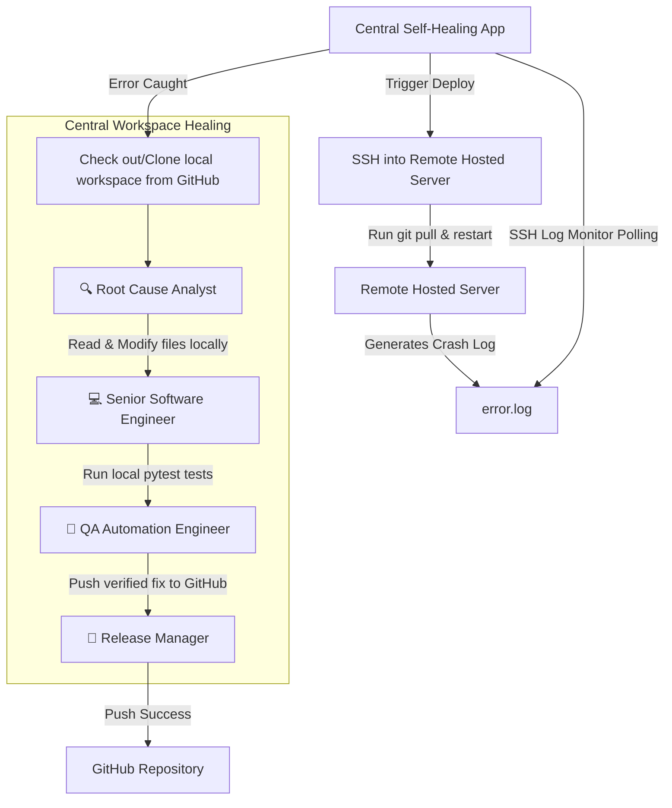

# 🩺 GitOps Agentic Self-Healing Code Pipeline

An automated, agentic code healing system powered by **CrewAI** and **local LLMs (LM Studio)**. This pipeline actively monitors your remote hosted application's logs for errors, automatically checks out/clones the repository from **GitHub** using your credentials, triggers a team of AI agents to diagnose and fix the bug locally, validates the fix by running unit tests, pushes the changes back to GitHub, and triggers an automated `git pull` deployment on your hosted production server!




---

## 🌟 Key Features

* **Real-time Log Monitoring**: Watches `app.log` continuously using `watchdog` to catch error stack traces immediately.
* **Intelligent Bug Diagnosis**: Spawns a **Root Cause Analyst** agent to analyze the exact traceback and read the corresponding source code.
* **Automated Code Fixing**: Spawns a **Senior Software Engineer** agent to modify the source code and apply the fix.
* **Automatic Testing & Validation**: A **QA Engineer** agent runs your test suite (`pytest`) to guarantee the applied fix doesn't break existing features.
* **Automated Version Control**: A **Release Manager** agent writes a clear, professional commit message and automatically commits the changes to Git.
* **Instant Notifications**: Receives email notifications (or console printouts) summarizing the crash and the exact fix implemented by the agents.

---

## 🛠️ Tech Stack & Dependencies

* **Core Logic**: Python 3.10+
* **Agentic Framework**: [CrewAI](https://github.com/crewAIInc/crewAI)
* **Log Monitoring**: `watchdog`
* **Version Control**: `GitPython`
* **Testing Framework**: `pytest`
* **Language Model**: Any coding LLM hosted locally via [LM Studio](https://lmstudio.ai/) (e.g., Gemma, Llama, Qwen).

---

## 🚀 Installation & Setup

### 1. Clone the Repository
```bash
git clone <your-github-repo-link>
cd self-healing
```

### 2. Set Up Virtual Environment & Dependencies
Create your virtual environment and install all dependencies:
```powershell
# Create virtual environment
python -m venv venv

# Activate virtual environment (Windows PowerShell)
.\venv\Scripts\Activate.ps1

# Install requirements
pip install -r requirements.txt
```

### 3. Configure Environment Variables
Create a `.env` file in the root directory (or update the existing one):
```env
# LLM Provider Configuration (Local LM Studio)
OPENAI_API_BASE=http://localhost:1234
OPENAI_API_KEY=lm-studio
OPENAI_MODEL_NAME=google/gemma-4-e4b

# Email Notification Configuration (Optional)
SMTP_SERVER=smtp.gmail.com
SMTP_PORT=587
SENDER_EMAIL=your_email@gmail.com
SENDER_PASSWORD=your_app_password
RECEIVER_EMAIL=your_email@gmail.com

# Target Repository Configuration (Multi-Repo Support)
# Leave as '.' to heal this project, or change to another directory on your machine
TARGET_REPO_PATH=.
TARGET_LOG_FILE=app.log
```

---

## 💻 How to Run and Test

### Step 1: Start LM Studio
1. Launch **LM Studio** on your machine.
2. Load your desired coding LLM.
3. Start the **Local Server** (ensure the port matches the `OPENAI_API_BASE` in your `.env`, e.g., `1234`).

### Step 2: Start the Log Monitor
Start the log monitoring service in your terminal:
```powershell
.\venv\Scripts\python.exe main.exe
```
This service will run continuously, waiting to catch exceptions in `app.log`.

### Step 3: Trigger a Bug (Simulate a Crash)
In a **new terminal**, run the included calculator script and redirect the error traceback into the `app.log` file in UTF-8 format:
```powershell
.\venv\Scripts\python.exe -c "import subprocess; r=subprocess.run(['.\\venv\\Scripts\\python.exe', 'calculator.py'], capture_output=True, text=True); open('app.log', 'w', encoding='utf-8').write(r.stderr)"
```

### Step 4: Watch the Self-Healing Pipeline
Switch back to your **Log Monitor** terminal. You will see the agents automatically wake up and fix the bug in real-time:
```text
New log entries detected:
Traceback (most recent call last):
  File "calculator.py", line 10, in <module>
    print(divide(10, 0))
ZeroDivisionError: division by zero

Error detected! Triggering self-healing pipeline...
--- Starting CrewAI Agents ---
[Root Cause Analyst] Working on: Analyze error log...
[Senior Software Engineer] Working on: Apply bug fix...
[QA Automation Engineer] Working on: Run pytest suite...
[Release Manager] Working on: Commit changes to Git...
--- CrewAI Agents Finished ---
Notification sent: Self-Healing Pipeline Success
```

---

## 🗂️ Project Structure

```text
├── calculator.py          # Contains the code with the division-by-zero bug
├── test_calculator.py     # Unit tests to validate the calculator logic
├── main.py                # Main entry point that boots the log monitor
├── log_monitor.py         # File watcher listening for logs in UTF-8
├── crew_workflow.py       # Defines CrewAI agents and tasks
├── tools.py               # custom agent tools (pytest execution, git commits, read/write)
├── notifier.py            # Utility for sending SMTP email/console notifications
├── requirements.txt       # Declares all Python dependencies
└── .env                   # Configuration file for LLM and emails
```

---

> [!TIP]
> **Pro-Tip**: Make sure your local repository is initialized with git (`git init`) and has an initial commit so that the Git Commit Agent can successfully stage and track modifications made by the Senior Software Engineer!


## Daily Activity Log
- [2026-07-29 21:08:09] Automated activity update (1/10)
- [2026-07-29 21:08:13] Automated activity update (2/10)
- [2026-07-29 21:08:16] Automated activity update (3/10)
- [2026-07-29 21:08:19] Automated activity update (4/10)
- [2026-07-29 21:08:22] Automated activity update (5/10)
- [2026-07-29 21:08:25] Automated activity update (6/10)
- [2026-07-29 21:08:28] Automated activity update (7/10)
- [2026-07-29 21:08:31] Automated activity update (8/10)
- [2026-07-29 21:08:33] Automated activity update (9/10)
- [2026-07-29 21:08:36] Automated activity update (10/10)
- [2026-07-30 20:19:34] Automated activity update (1/10)
- [2026-07-30 20:19:38] Automated activity update (2/10)
- [2026-07-30 20:19:40] Automated activity update (3/10)
- [2026-07-30 20:19:43] Automated activity update (4/10)
- [2026-07-30 20:19:52] Automated activity update (5/10)
- [2026-07-30 20:19:55] Automated activity update (6/10)
- [2026-07-30 20:19:58] Automated activity update (7/10)
- [2026-07-30 20:20:01] Automated activity update (8/10)
- [2026-07-30 20:20:04] Automated activity update (9/10)
- [2026-07-30 20:20:07] Automated activity update (10/10)
- [2026-07-31 10:19:18] Automated activity update (1/10)
- [2026-07-31 10:19:21] Automated activity update (2/10)
- [2026-07-31 10:19:24] Automated activity update (3/10)
- [2026-07-31 10:19:27] Automated activity update (4/10)
