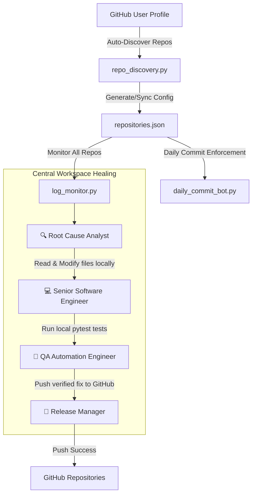

# 🩺 GitOps Agentic Self-Healing Code Pipeline & Profile Monitor

An automated, agentic code healing system powered by **CrewAI** and **local LLMs (LM Studio)**. This pipeline actively monitors your remote hosted application logs or local application logs for errors across **all repositories in your GitHub profile**, automatically checks out/clones repositories from **GitHub** using your credentials, triggers a team of AI agents to diagnose and fix bugs locally, validates fixes by running unit tests, pushes changes back to GitHub, and triggers automated deployments!



---

## 🌟 Key Features

* **GitHub Profile Auto-Discovery**: Automatically queries GitHub API for all public and private repositories in your profile (`GITHUB_USERNAME`, `GITHUB_TOKEN`).
* **Multi-Repository Log Monitoring**: Simultaneously monitors logs across all repositories in your profile.
* **Intelligent Bug Diagnosis**: Spawns a **Root Cause Analyst** agent to analyze exact tracebacks and inspect source code.
* **Automated Code Fixing**: Spawns a **Senior Software Engineer** agent to modify code and apply fixes.
* **Automatic Testing & Validation**: A **QA Engineer** agent runs `pytest` suites to guarantee applied fixes don't break features.
* **Automated Version Control**: A **Release Manager** agent commits and pushes clean, tested code.
* **Profile-Wide Daily Commit Bot**: Ensures minimum target daily commits across all repositories in your profile.

---

## 🌐 Profile-Wide Repository Monitoring

To monitor **all repositories in your GitHub profile**:

### 1. Sync Profile Repositories
Run `repo_discovery.py` or use `--sync-profile` to automatically fetch all profile repos into `repositories.json`:

```bash
# Sync all GitHub profile repositories into repositories.json
python repo_discovery.py
```

### 2. Monitor Profile Repositories
Start the main pipeline with profile synchronization and daily commit tracking enabled:

```bash
# Sync profile repos, enforce minimum 10 daily commits across all profile repos, and start log monitor
python main.py --sync-profile --enforce-daily-commits --all-repos
```

### 3. Profile-Wide Daily Commit Tracking
Check or enforce minimum daily commits across all profile repositories:

```bash
# Check today's commit count across all profile repos
python daily_commit_bot.py --all-repos --check-only

# Enforce minimum 10 commits today for all profile repos
python daily_commit_bot.py --all-repos --min-commits 10
```

---

## 🛠️ Tech Stack & Dependencies

* **Core Logic**: Python 3.10+
* **Agentic Framework**: [CrewAI](https://github.com/crewAIInc/crewAI)
* **Log Monitoring**: `watchdog`
* **Version Control**: `GitPython`
* **Testing Framework**: `pytest`
* **Language Model**: Any coding LLM hosted locally via [LM Studio](https://lmstudio.ai/)

---

## 🗂️ Project Structure

```text
├── repo_discovery.py      # Auto-discovers all GitHub user repositories via API
├── repositories.json       # Config file storing all profile repository configurations
├── repository/            # Single folder containing all profile repository clones (git-ignored)
├── main.py                # Main entry point booting multi-repo log monitor
├── daily_commit_bot.py    # Enforces minimum daily commits across profile repos
├── log_monitor.py         # Multi-repository log monitor (watchdog + SSH)
├── crew_workflow.py       # CrewAI agent team (Root Cause, Engineer, QA, Release)
├── tools.py               # Custom tools (pytest execution, git commits, file IO)
├── notifier.py            # Utility for sending email/console notifications
├── requirements.txt       # Python dependencies
└── .env                   # Configuration for LLM, email, and GitHub API credentials
```

---

> [!TIP]
> **Pro-Tip**: Make sure your local repository is initialized with git (`git init`) and has an initial commit so that the Git Commit Agent can successfully stage and track modifications made by the Senior Software Engineer!


